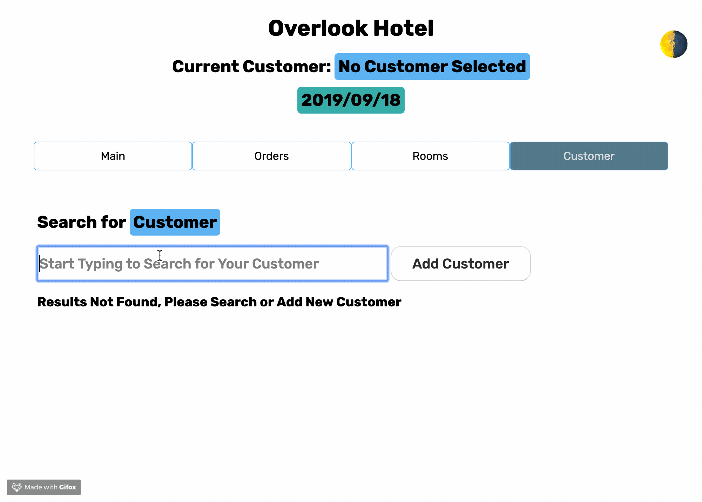
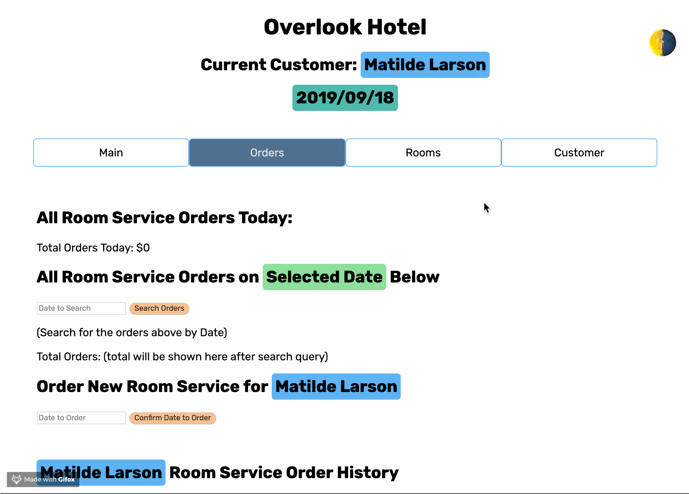
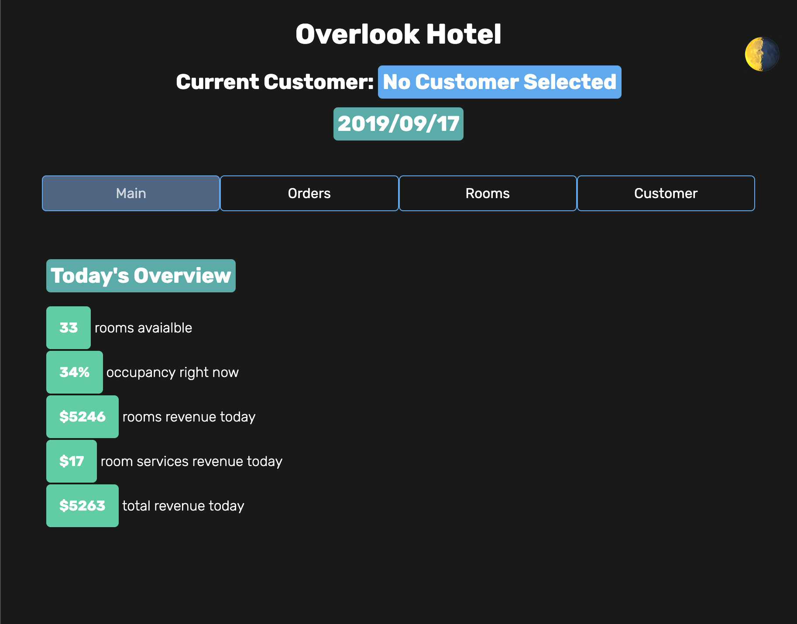
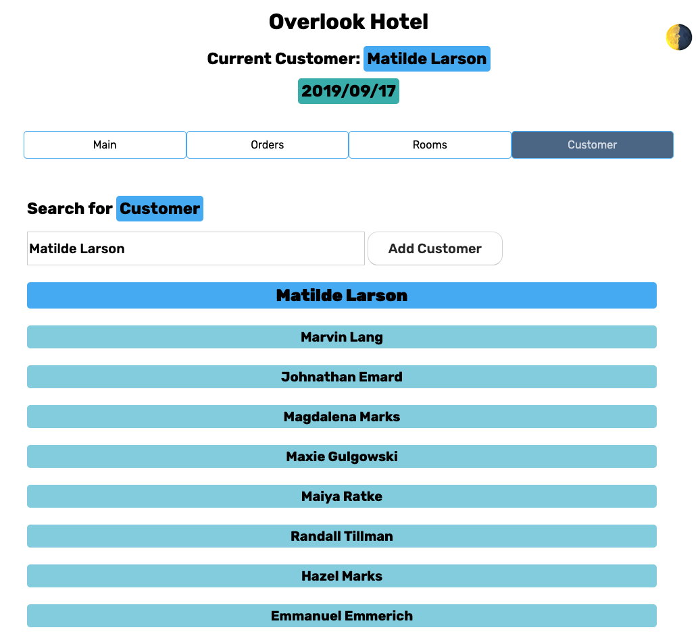
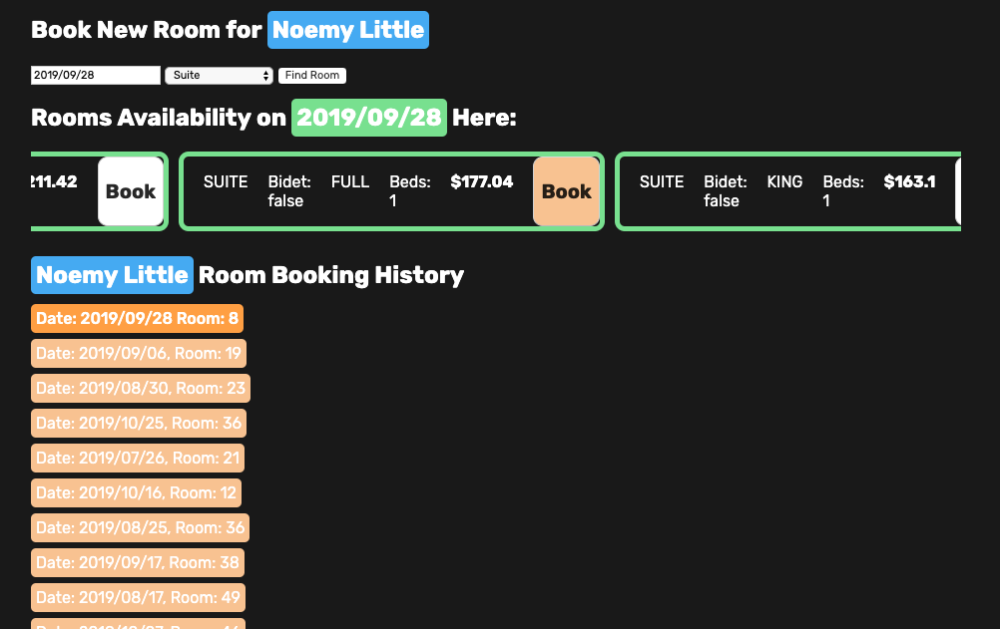
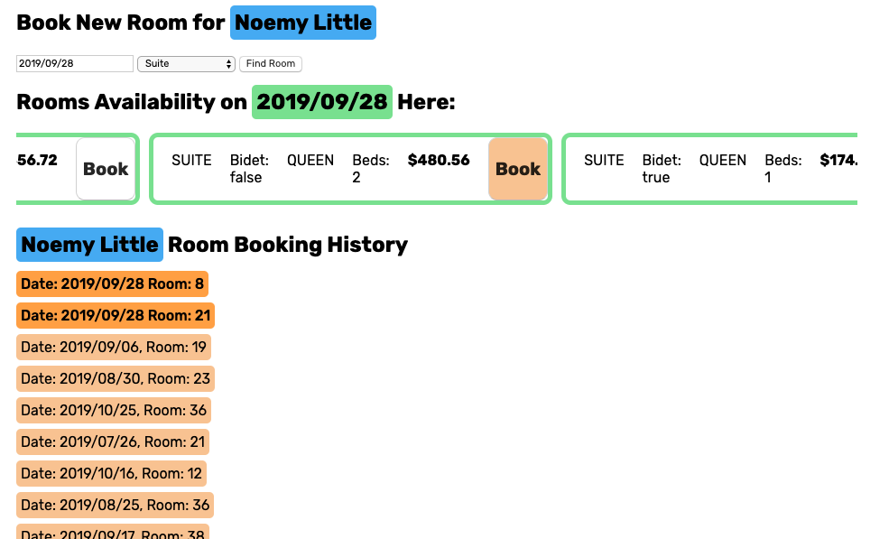
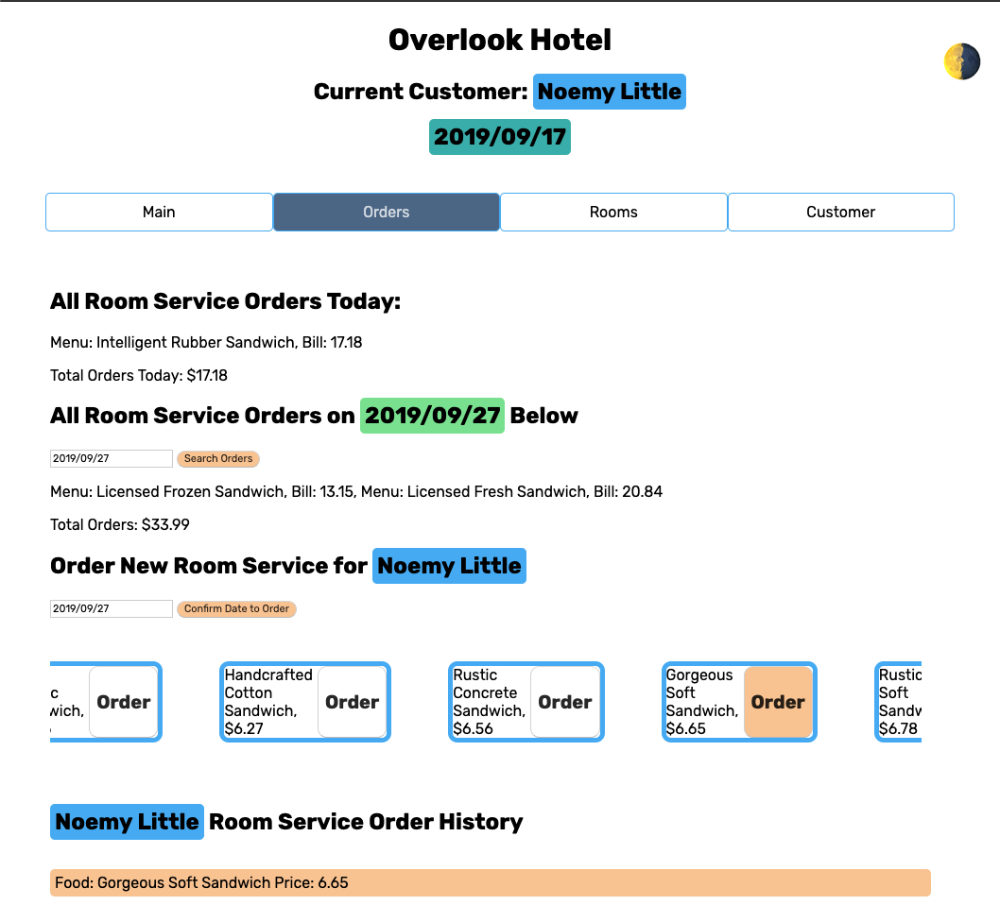

# Overlook: Management Application for Hotel Staffers
[Live Site](https://peeratmac.github.io/overlook)

## What is it?

Hotel Staffers and Management Team Use Cases:

- Looking up existing customers already stayed at the hotel before or currently staying
- Overview at a glance of how full the hotel is today, what is available to be booked
- Book a room for specific customer, on a specific day, with list of availabilities and preferences in room types and pricing
- Book a room service (food ordering with menu and pricing)

## Known Issues

[List of Issues can be found here](https://github.com/peeratmac/overlook/issues)

## Working Product GIFS

### Customer and Rooms Tab

### Room Booking

### Dark Mode and Room Service

## Thank you:

- JavaScript
- jQuery
- jQuery UI
- Mocha, Chai, Chai Spies
- HTML
- CSS (Sass)
- Webpack
- [Flat UI Color](https://flatuicolors.com/)

## Objectives

- Use OOP to drive the design of the application and the code
- Separate business-logic code from view-related code
- Create a robust test suite
- Thoroughly tests all functionality of a client-side application
- Build the application in sprints through user stories

## How to Install

1. Fork and clone down this repository
2. In your Terminal, access the directory of this repository
3. Run `npm install` to install the webpack dependencies
4. Once it has finished installing, run `npm start`
5. Go to the localhost address `ex. http://localhost:8080/`

## Relevant Static Screenshots

